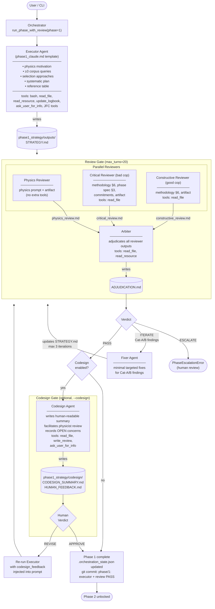

# JFC Phase 1 — Strategy Workflow

## Artifacts

| File | Written by |
|---|---|
| `phase1_strategy/outputs/STRATEGY.md` | Executor |
| `phase1_strategy/review/physics_review.md` | Physics Reviewer |
| `phase1_strategy/review/critical_review.md` | Critical Reviewer |
| `phase1_strategy/review/constructive_review.md` | Constructive Reviewer |
| `phase1_strategy/review/ADJUDICATION.md` | Arbiter |
| `phase1_strategy/codesign/CODESIGN_SUMMARY.md` | Codesign Agent (optional) |
| `phase1_strategy/codesign/HUMAN_FEEDBACK.md` | Codesign Agent (optional) |

## `max_turns` defaults

Each agent in the orchestration stack has a default turn budget that can be overridden globally via `run_jfc_analysis(max_turns=N)`. When `max_turns` is `None` the per-agent defaults apply:

| Agent | Default turns |
|---|---|
| Executor | 50 |
| Note Writer / Typesetter | 30 |
| Review Gate (all reviewers + arbiter) | 20 |
| Fixer | 30 |
| Investigator | 20 |
