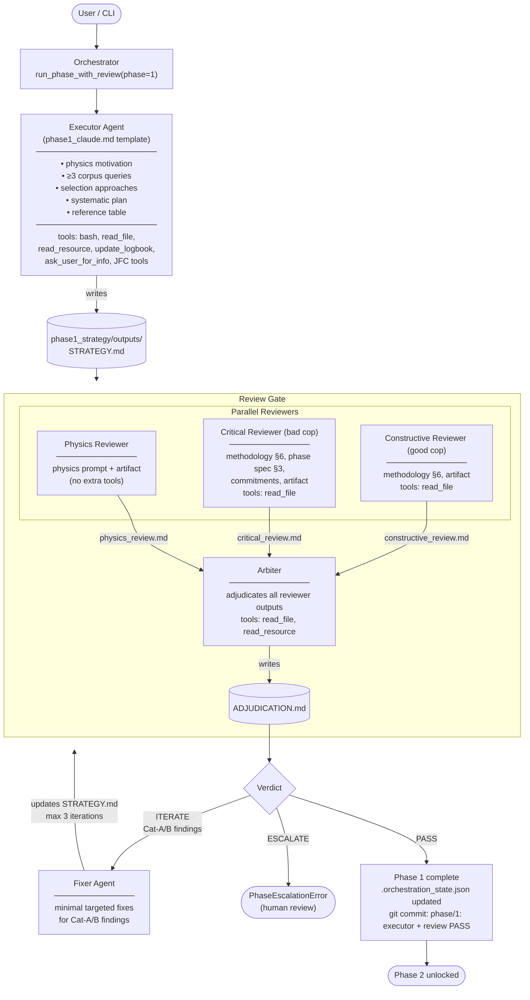

# JFC Phase 1 — Strategy Workflow

## Artifacts

| File | Written by |
|---|---|
| `phase1_strategy/outputs/STRATEGY.md` | Executor |
| `phase1_strategy/review/physics_review.md` | Physics Reviewer |
| `phase1_strategy/review/critical_review.md` | Critical Reviewer |
| `phase1_strategy/review/constructive_review.md` | Constructive Reviewer |
| `phase1_strategy/review/ADJUDICATION.md` | Arbiter |
